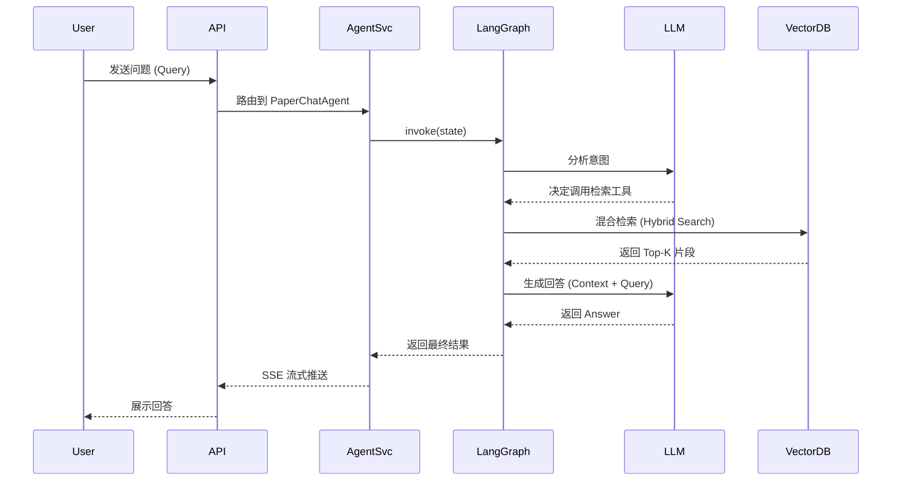
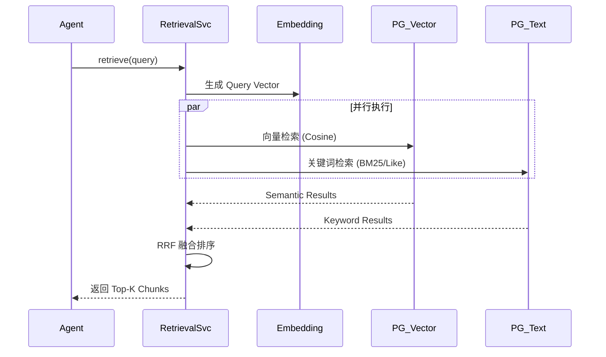
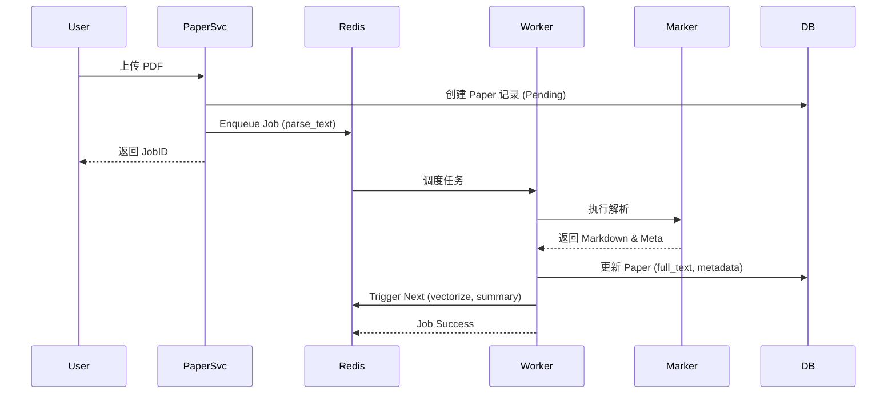
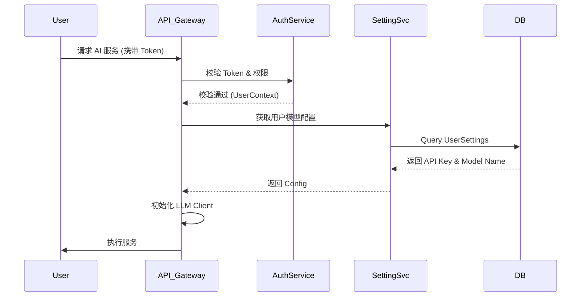

4.2 关键模块设计

4.2.1 基于 LangGraph 的 Agent 编排模块设计
DeepPaperResearcher 的核心在于多智能体协同，Agent 编排模块负责调度 SummaryAgent、MindMapAgent 和 PaperChatAgent。设计理念基于 ReAct (Reasoning + Acting) 模式，利用 LangGraph 定义状态图。
1. **SummaryAgent**: 采用单节点图结构。接收论文全文作为输入，根据预设的 Prompt 模板（包含背景、方法、结果等部分），调用 LLM 生成结构化摘要，并存储至 `PaperSummary` 表。
2. **PaperChatAgent**: 采用循环图结构。包含 `Agent` 节点和 `Tools` 节点。`Agent` 节点分析用户 Query，决定是否调用 `retrieve_paper_tool`；若调用，流程流转至 `Tools` 节点执行向量检索，获取上下文后返回 `Agent` 节点生成最终回答。
3. **状态持久化**: 利用 LangGraph 的 Checkpointer 机制，将 Agent 的运行状态（如对话历史 `messages`）持久化至 PostgreSQL，确保多轮对话的连续性。

图 4-2 Agent 编排模块顺序图

4.2.2 混合检索 (Hybrid Retrieval) 模块设计
检索模块是 RAG 系统的基石，旨在从海量文献中精准召回相关上下文。本系统设计了基于 pgvector 的混合检索策略。
1. **向量检索 (Semantic Search)**: 使用 OpenAI Embedding 模型将 PDF 文本块（Chunk）转换为 1536 维向量，存储于 `PaperChunk` 表的 `embedding` 字段。查询时计算 Cosine Similarity。
2. **关键词检索 (Keyword Search)**: 利用 PostgreSQL 的全文检索功能（tsvector），对文本块进行分词索引，弥补向量检索对专有名词（如 "ResNet-50", "Transformer"）敏感度不足的问题。
3. **RRF 融合**: 实现倒数排名融合算法（Reciprocal Rank Fusion），公式为 $Score = \frac{1}{k + rank_{semantic}} + \frac{1}{k + rank_{keyword}}$，对两路检索结果进行加权重排序，输出最终的 Top-K 结果。

图 4-3 混合检索模块顺序图

4.2.3 PDF 解析与知识库构建模块
该模块负责将非结构化的 PDF 转换为结构化的知识数据。
1. **双引擎解析**:
    - **Marker**: 用于高质量全文解析，识别章节结构、公式和表格，输出 Markdown。
    - **PyMuPDF**: 用于快速提取元数据（标题、作者、页数）和生成缩略图。
2. **异步任务链**: 解析过程封装为 `parse_text` Job，由 Arq Worker 异步执行。解析完成后，触发 `vectorize` Job（文本切分 + Embedding）和 `summary` Job（生成摘要），实现“上传即处理”的自动化流水线。
3. **数据存储**: 解析后的全文存入 `Paper` 表的 `full_text` 字段，切分后的片段存入 `PaperChunk` 表。

图 4-4 PDF 解析模块顺序图

4.2.4 用户权限与模型配置模块
为了平衡系统灵活性与资源成本，设计了用户级的模型配置模块。
1. **模型偏好设置**: 用户可在个人中心配置不同 Agent（Summary, Chat）使用的 LLM 模型。例如，摘要生成使用 GPT-3.5-Turbo（成本低），深度问答使用 GPT-4o（效果好）。
2. **API Key 管理**: 系统支持用户填入自己的 OpenAI/DeepSeek API Key。若未填，则使用系统默认的共享 Key（受限流控制）。
3. **权限控制**: 基于 OAuth2 和 JWT 实现认证。系统通过 Middleware 拦截请求，校验 Token 有效性，并根据用户角色（普通用户/VIP）限制每日的 PDF 解析次数和 AI 对话轮数。

图 4-5 权限与配置模块顺序图
